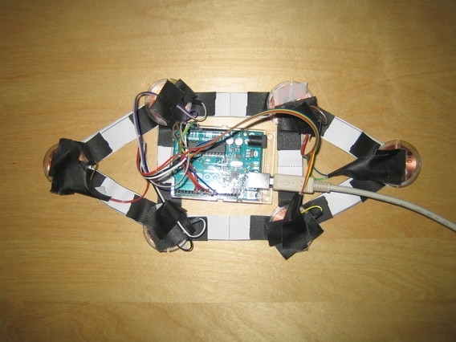
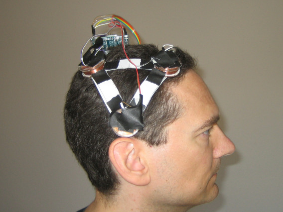

TMSuino
========

_A low-cost arduino-based TMS ([transcranial magnetic stimulation](https://en.wikipedia.org/wiki/Transcranial_magnetic_stimulation)) device to influence the symptoms of bipolar disorder._

## Table of contents

- [Getting Started](#getting-started)
  - [The Picture](#picture)
  - [Prerequisites](#prerequisites)
- [Building it](#building-it)
- [Application](#application)
- [Rationale](#rationale)
- [License and Disclaimer](#license-and-disclaimer)
- [Contributions and Questions](#contributions-and-questions)

## Getting Started

Despite over 30 years of activity and over 500 patents **transcranial magnetic stimulation** hasn't yet found broad adoption.

It is my personal opinion that the reasons for this are two-fold:

1. On-going dispute about it being a placebo effect - due to a lack of provable scientific explanations

2. High costs - due to a focus on complex research devices

This projects' focus is on the second point: Drastically cutting down costs.

This is achieved using an Arduino UNO as the main driver module. Overall cost of parts is below 63 Euros ($75 as of August 2017).

The device requires no soldering, tools needed are a pair of scissors and a measuring tape / ruler / yardstick.

### Picture

Here's a picture of the thing:

It is worn like a cap:

### Prerequisites

1. Arduino UNO R3 - as driver module

2. Six coreless coils - to create magnetic fields

3. Jumper cables - for wiring the coils to the arduino

4. Cloth tape - to put everything together

5. Double faced tape - to fix the coils onto the cap

6. Tools: A sturdy pair of scissors - for all cutting tasks

7. Optional tools: A printer - to print the placement pattern

8. Optional parts: USB power adapter or 9V power adapter or 9V battery holder - as alternative power sources

[For more details read the part list](partlist/README.md)

## Building it

It takes about two hours to build the device:

1. Making the cap 
  [For more details see coil setup procedure](coilsetup/README.md)

2. Wiring 
  [For more details see the wiring description](wiring/README.md)

3. Arduino Code 
  [For more details see the code readme](code/README.md) 
  [And if problems persist the troubleshooting readme](troubleshooting/README.md)

4. Fixing jumper cables 
  [See the details on fixing here](fixing/README.md)

## Application suggestions

#### Side effects

Sessions of 15 minutes' length might be required to register any effects. Head aches, a "pressure feeling", can occur - these are expected to be harmless and temporary. Slight nausea, especially on an empty stomach, can occur - this is expected to lessen after one week of application.

#### What to watch out for

The desired effect would be called **"sobering"** - hinting the disruption of a manic phase. Or **"stabilizing"** - hinting the improvement of a depressive phase. Nothing is felt if no phase was active or no change occurred.

**This is no treatment plan - just a starting point for your own research efforts.** 

When you end a sitting, check that the LED of the Arduino is still on and _not_ blinking. Then you know it has not gone into error mode some time during the sitting.

## Rationale

If you are curious why mentioned parts and materials where selected, [read the details in the rationale](rationale/README.md).
But you don't need to know this to build and use the device.

## License and Disclaimer

For anything to be low-cost it must be open-source. Otherwise third parties will always take their share.

Therefore this work is licensed under CC0; putting all of it into the public domain. See the [full text of CC0 here](License-CC0.txt)

## Legal issue

For legal reasons every person that wants to try this device has to build it by themselves.

## Contributions and Questions

Are welcome. Please see the [contributing and questions section](contributing/README.md) for more. 

