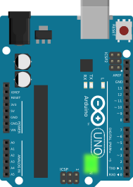
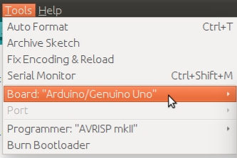
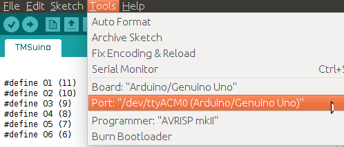
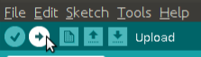
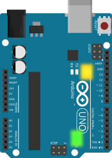

# Arduino Code

There are very good Arduino tutorials available on the internet. As such I am only providing a rough outline of how to do it.

1. Install the [Arduino IDE](https://www.arduino.org/)

2. Connect the Arduino via the USB cable. 
  A green LED on the board lights up.
  
  

3. Download the [.ino file](../TMSuino/TMSuino.ino) and open it with the Arduino IDE.

4. In the Arduino IDE open the "Tools" menu and make sure "Board:" is set to "Arduino/Genuino UNO"

  
  
5. In the same menu make sure "Port:" is not greyed-out. It should point to the Arduino device as "COM1" or "COM2" or "COMx" or "/dev/ttyACM0" depending on your operating system.

  
  
  On ubuntu you might need to type: 
```bash
sudo chmod a+rw /dev/ttyACM0
```
  otherwise the next step might fail.

6. Click "Upload"

  
  
  There is a row of three yellow LEDs on the board. The two leftmost yellow LEDs on the board should flicker for a short moment, that's the upload.
  
7. After a few seconds, the rightmost of the yellow LEDs should light up and stay constantly alight.
  If it blinks fast, one of the coil connections is broken or connected in the wrong way.
  In that case go back to wiring and check all connections.
  
  


#### If the LED is on and does not blink, go on to [fix all cables](../fixing/README.md).

#### If you have problems even after re-checking the wiring look into [Troubleshooting/Diagnostics](../troubleshooting/README.md)

[Main Page](../README.md)
