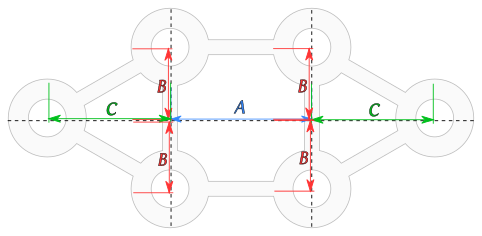
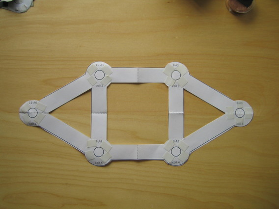
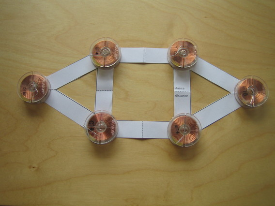
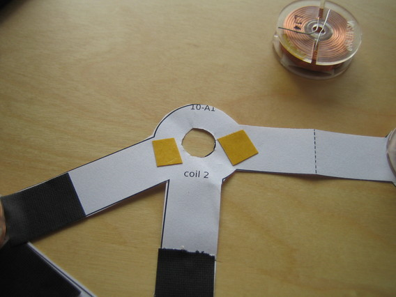
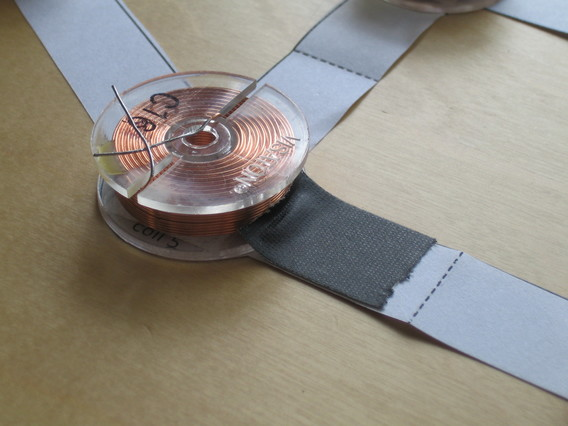
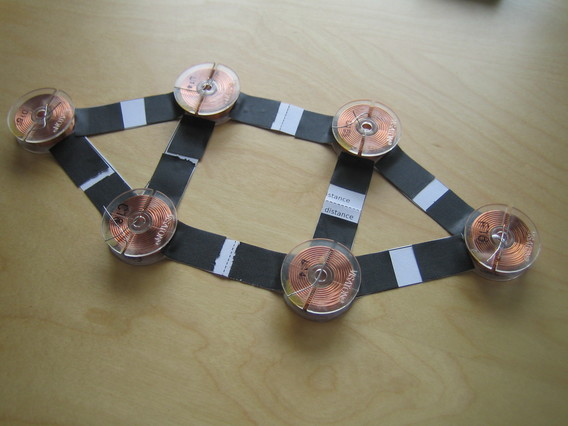
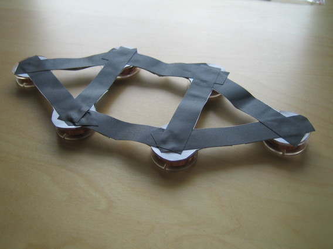

# Coil Setup


This is the coil pattern I designed. The coils are laid out at the circle positions and then connected with tape along the displayed bands.
The lengths of all the bands connecting the coils are all the same. This is by design, to spread the field over the brain.
The size of the pattern should be selected so that the outer coils are just above the ears.
Measure the distance between the ears along the top of the head. Use a measuring tape if available, use a piece of paper and ruler on the paper if not.

If you have a printer avaiable, you can then select one of the following [prepared templates](#prepared-pattern-templates-for-printing), print it and do the cut-out.

For those who need to draw it by hand, here is how to do that:

## Drawing the pattern template by hand

#### Calculating distances A,B,C

Use your measurement of the ear-to-ear length to calculate the lengths A,B and C.

Here is the [calculator on jsfiddle.net](https://jsfiddle.net/TMSuino/aajudjLj/embedded/result/)...

...or you can use these formulas:

```javascript
margin = 3 cm or 2 inch;
A = (ear2ear - margin - diameterCoil)*0.366025;
B = a*0.5;
C = Math.sqrt(Math.pow(a,2)-Math.pow(a*0.5,2));
```

#### Drawing



The bands between the coil circles should be wide enough so the tape does not overflow. Otherwise the tape would later stick to the hair.
Furthermore, if your coils have a large inner diameter center holes might have a use for you. 

## Prepared pattern templates for printing

Following patterns are made for 3.6cm coil holder diameter and 19mm tape width.
Make sure printer dialogs' page setup is set to landscape.

Pattern with 1cm margin:

- [coilpattern-28.00cm-11.02in-A4-margin1.pdf](../print-patterns/coilpattern-28.00cm-11.02in-A4-margin1.pdf)
- [coilpattern-29.00cm-11.42in-A4-margin1.pdf](../print-patterns/coilpattern-29.00cm-11.42in-A4-margin1.pdf)
- [coilpattern-30.00cm-11.81in-A4-margin1.pdf](../print-patterns/coilpattern-30.00cm-11.81in-A4-margin1.pdf)
- [coilpattern-31.00cm-12.20in-A4-margin1.pdf](../print-patterns/coilpattern-31.00cm-12.20in-A4-margin1.pdf)
- [coilpattern-32.00cm-12.60in-A4-margin1.pdf](../print-patterns/coilpattern-32.00cm-12.60in-A4-margin1.pdf)
- [coilpattern-33.00cm-12.99in-A4-margin1.pdf](../print-patterns/coilpattern-33.00cm-12.99in-A4-margin1.pdf)
- [coilpattern-34.00cm-13.39in-A4-margin1.pdf](../print-patterns/coilpattern-34.00cm-13.39in-A4-margin1.pdf)
- [coilpattern-35.00cm-13.78in-A4-margin1.pdf](../print-patterns/coilpattern-35.00cm-13.78in-A4-margin1.pdf)

Pattern with 3cm margin:

- [coilpattern-28.00cm-11.02in-A4-margin3.pdf](../print-patterns/coilpattern-28.00cm-11.02in-A4-margin3.pdf)
- [coilpattern-29.00cm-11.42in-A4-margin3.pdf](../print-patterns/coilpattern-29.00cm-11.42in-A4-margin3.pdf)
- [coilpattern-30.00cm-11.81in-A4-margin3.pdf](../print-patterns/coilpattern-30.00cm-11.81in-A4-margin3.pdf)
- [coilpattern-31.00cm-12.20in-A4-margin3.pdf](../print-patterns/coilpattern-31.00cm-12.20in-A4-margin3.pdf)
- [coilpattern-32.00cm-12.60in-A4-margin3.pdf](../print-patterns/coilpattern-32.00cm-12.60in-A4-margin3.pdf)
- [coilpattern-33.00cm-12.99in-A4-margin3.pdf](../print-patterns/coilpattern-33.00cm-12.99in-A4-margin3.pdf)
- [coilpattern-34.00cm-13.39in-A4-margin3.pdf](../print-patterns/coilpattern-34.00cm-13.39in-A4-margin3.pdf)
- [coilpattern-35.00cm-13.78in-A4-margin3.pdf](../print-patterns/coilpattern-35.00cm-13.78in-A4-margin3.pdf)
  
## Pattern cut-out


Read [here the step-by-step procedure](../cutout/README.md) to reach this cut-out with minimum effort.

## Place coils

After cutting out the shape, place the coils on the circles. Here you need to use double-faced tape to help fix the coils.








#### Run tape between coils





Make sure the tape does not overflow the paper template, otherwise hair will later stick to the tape.

#### Turn around and tape other side



#### Put on head

The coils should not touch the ears, as this gets uncomfortable over time.
Have a look into the mirror, walk around a bit and feel if you are comfortable with it.
Because now is the time to change the size if necessary.

#### Turn to front side again, and this step is done!


## Continue with [wiring](../wiring/README.md)

[Main Page](../README.md)
