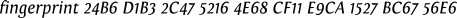

Contributing and Questions
========

If you have questions you can reach me via e-mail [martin.mueller.78@web.de](mailto:martin.mueller.78@web.de) but please keep in mind that I cannot and will not give medical advice. I will only answer to those mails that have a **public** key attached, so I can easily encrypt my answer.
I believe this is prudent and in your best interests.

Furthermore putting an e-mail address into the open typically leads to a lot of spam. I believe spammers won't send public keys with their mails, leaving me an easy option to filter that stuff.

Of course, your are encouraged to encrypt your e-mails as well. Here is my [public key](martin.mueller.78@web.de_(0xBC6756E6)_pub.asc) also available via Enigmail Keyserver.

Please note that encrypting an e-mail only encrypts the content. Subject, sender and recipients are still visible to anybody.

I cannot guarantee to answer each and every question. But I will try to keep you informed of important developments.

You are welcome to contribute, especially nicer pictures are dearly hoped for! If you made those, please upload them to a dropbox account, add a LICENSE.txt file (preferably CC0) and send me a link.

As of this moment I have only limited knowledge about suitable distributors, and these are all based in Germany.
So if you got a good deal in your region, let me know. 

# Answers

_Some questions might be of interest for many. I might put my answer in this section, creating a FAQ, while doing my best to keep the asker anonymous by rephrasing the question._

