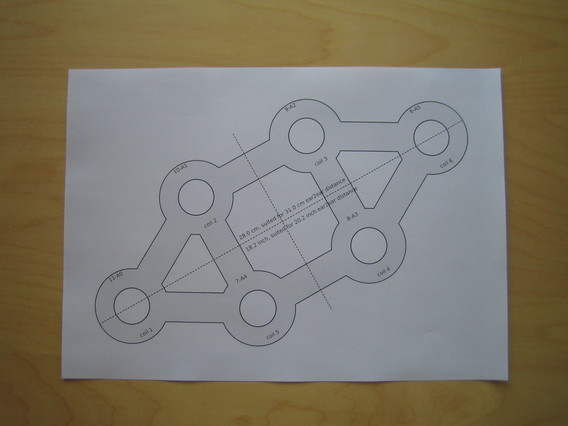
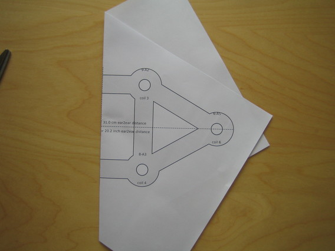
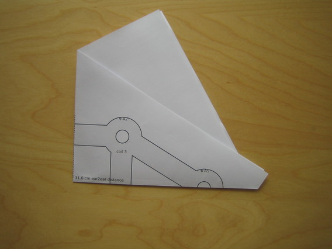
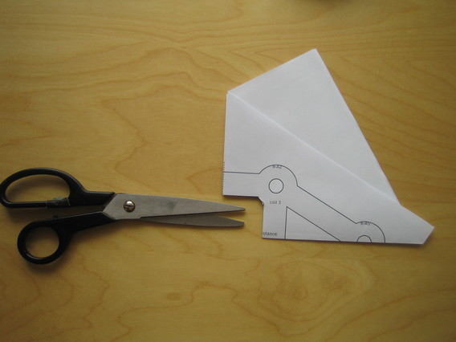
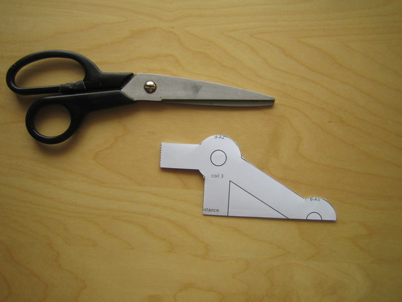
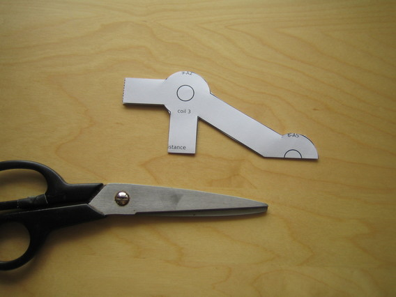
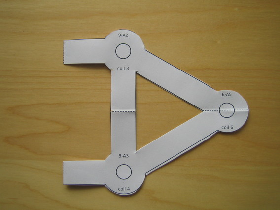
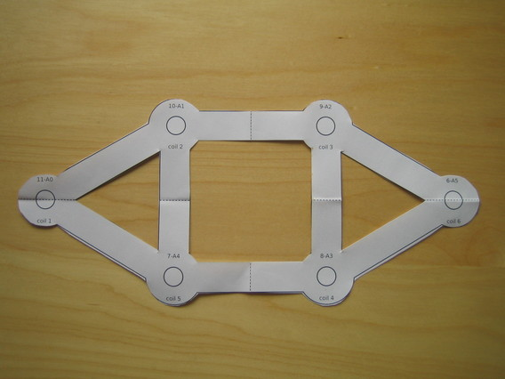

Pattern cut-out step by step
========

First fold it twice along the dashed lines:

Then it is easier to cut:

The inner holes are only for those who have coils with large inner holes and would like to fasten them differently.

And now unfold it again:

Tadaa!
That's it, continue with [placing the coils](../coilsetup/README.md#place-coils)

[Main Page](../README.md)   [Coil setup](../coilsetup/README.md)

