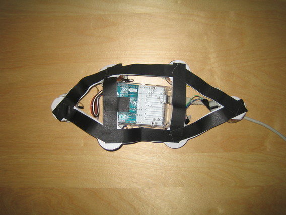
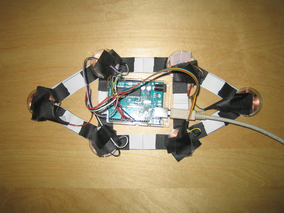

# Fixing jumper cables

This step is to make sure the jumper cables don't get loose.
You have already taped one of the wire ends onto the coil holder to keep the wires from making contact:

Now do it for the other wire end as well, so all are taped on the coil holders:

Now we secure the jumpers against tugging. Here's an example:

Stick some tape around the cable and then tape it to the coil holder. Here's a more radical example:

Check by lightly tugging the cables. The tension should be held by the tape and not reach the jumper plugs at all.

Now fix the Arduino board to the cap as shown here. Only fix the side opposite of the USB plug with one piece of tape.

Make sure not to tug the USB cable, otherwise the arduino might get loose.

Final result:

# You did it! 

[Go back to Main Page](../README.md#building-it)

