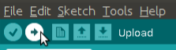

# Troubleshooting / Diagnostics

If problems persist the best way is to get more info first, like this:

1. Connect the Arduino via USB and start up the Arduino IDE.

2. Download the [Diagnostic .ino file](../TMSuino-Diagnostic/TMSuino-Diagnostic.ino) and open it with the Arduino IDE.

3. Steps like before:
  In the Arduino IDE open the "Tools" menu and make sure "Board:" is set to "Arduino/Genuino UNO"
  In the same menu make sure "Port:" is not greyed-out. It should point to the Arduino device as "COM1" or "COM2" or "COMx" or "/dev/ttyACM0" depending on your operating system

4. In the Arduino IDE open the "Tools" menu and open the "Serial Monitor"
  

5. Make sure the "Serial Monitor" is set to "9600 baud", it's in the lower right status of the Serial Monitor window.
  

6. Click "Upload"
  

7. Now messages should appear in the "Serial Monitor" window, as shown in the image above. That's the diagnostic tool telling you its feelings.
  That gives you details about what's going wrong. 
  Make sure to copy these messages and send them along if you want to ask for help.
  Note: If one of the cables is open a lot of false readings are created. So first connect everything before using this tool.
  It _cannot_ be used to tell you which cable to connect next.

8. **As soon as the diagnostic tool is uploaded the device does not work anymore until you [re-upload the normal code](../code/README.md)!!!**

[Main Page](../README.md)    [Arduino Code](../code/README.md)
