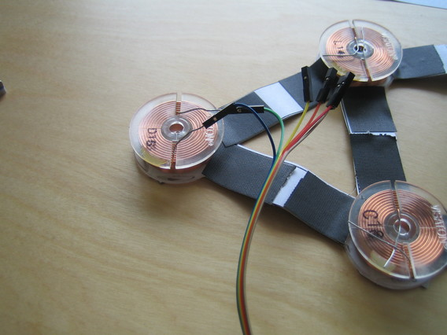
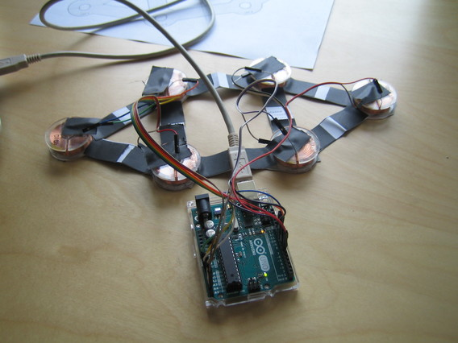

# Wiring

Ideally anyone would use long jumper cables of 1.2-1.5m length and keep the arduino off the head.

But sadly, as of August 2017, no such cables can be purchased.

As a workaround the arduino is kept close to the coils so the standard 25cm length cables are sufficient.

Here is the fritzing-style drawing of how to connect it:

Of course, there is only **one** arduino. I just displayed it two times so the wires don't cross that much in the drawing.

Just do it step by step, connect the outer coil ends with arduino pins 11 to 6. And the inner coil ends with arduino pins A0 to A5.
Please note that the four center coils are numbered and connected clockwise. Make sure your wiring is exactly like that.
 
| Pin Arduino for outer coil end | Coil | Pin Arduino for inner coil end |
|----|----|----|
| 11 | 1 | A0 |
| 10 | 2 | A1 |
|  9 | 3 | A2 |
|  8 | 4 | A3 |
|  7 | 5 | A4 |
|  6 | 6 | A5 |

# Pictures step-by-step

I have a 20-wire dupont female-female cable here. It came with a bag of pins to convert the female clips to male clips as desired.

I made two strands of 6 wires each and started to convert it into female-male jumpers:

 

The began plugging coils, starting with coil 1:

The wire ends of the coils bend easily. So be very careful with inserting them into the jumper plug.
They have to go some way in, approx. 3mm - take some time for this! It's a crucial step.

Here's another picture, now coils 1,2 and 5 have been plugged to one 6-wire cable:

When I did this a little problem occurred.
I couldn't plug in one of the wire ends, as the tinned end was a bit bulky.
I just used my pair of sturdy tried and tested scissors and cut-off two millimeters of the tinned wire end.
Then everything went smoothly.

And all coils plugged:

Now coils 1 and 2 can be connected to the arduino. 

The next two coils to connect are coils 3 and 4!

Ah. Have a closer look at the coils. There is an outer coil wire end and inner end:

Outer coil end is marked in blue, inner coil end in green.
I connected all outer coil ends to the arduino pins 11-6 (right side in photo).
And all inner coil ends to the arduino pins A0-A5 (left side in photo).

It doesn't matter which way you choose, but all coils must be connected in the same way!

Then, since the wires are bare and could make contact to each other tape one of each wire ends onto the coil holder as seen here:

As you can see I already connected the arduino, that's your next step as well. Go on to test your connections.

# Continue with [Arduino Code](../code/README.md)

[Main Page](../README.md)
